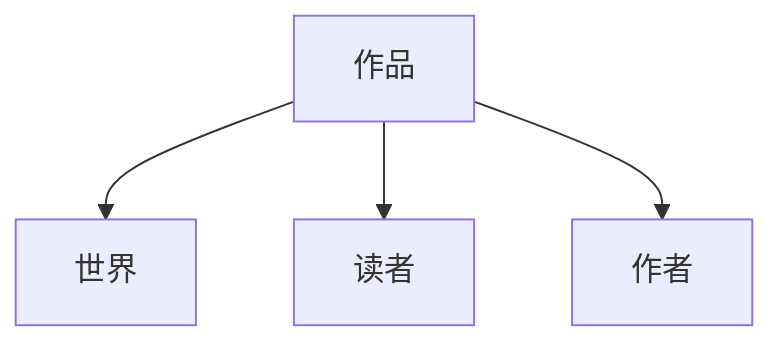
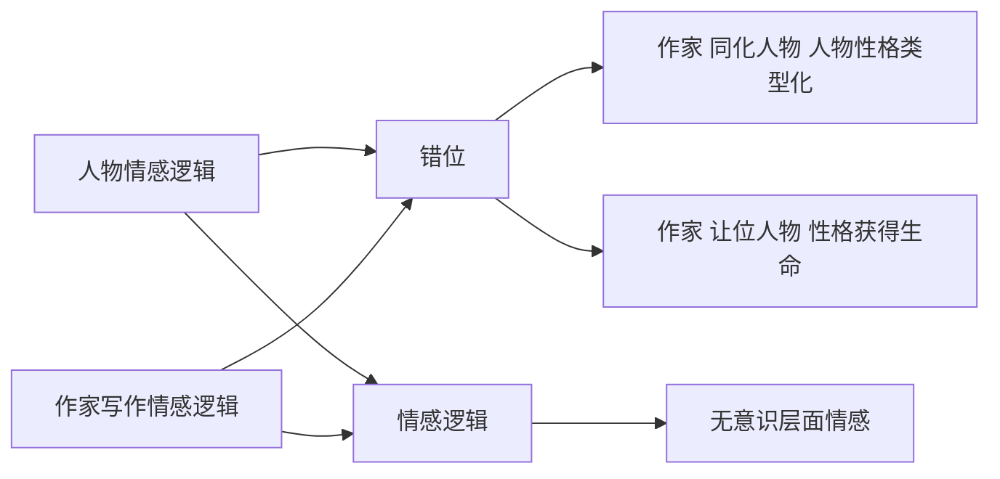
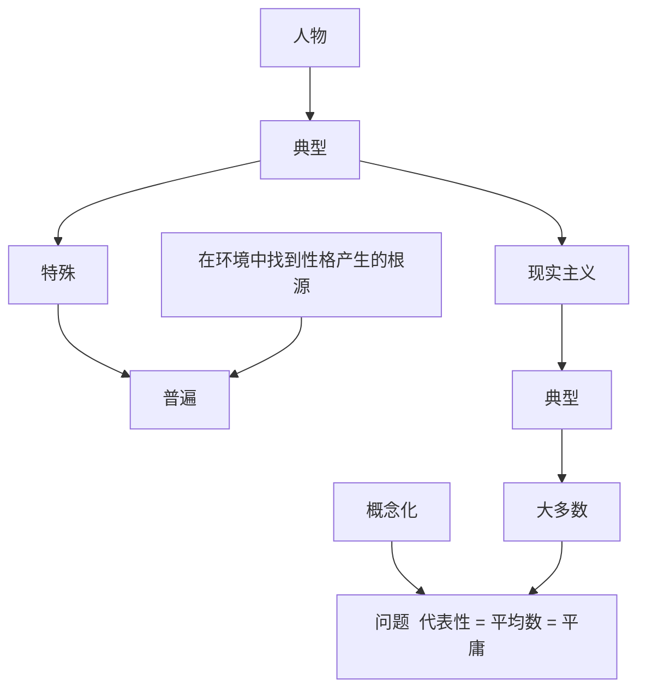
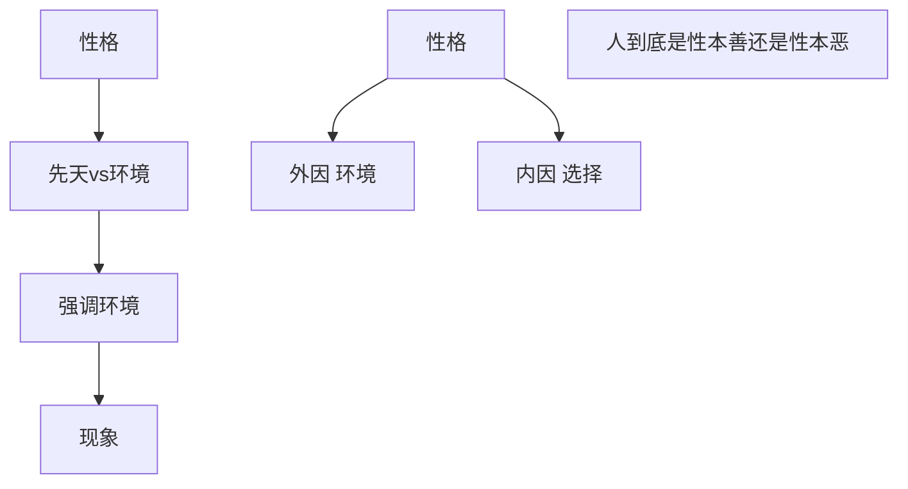
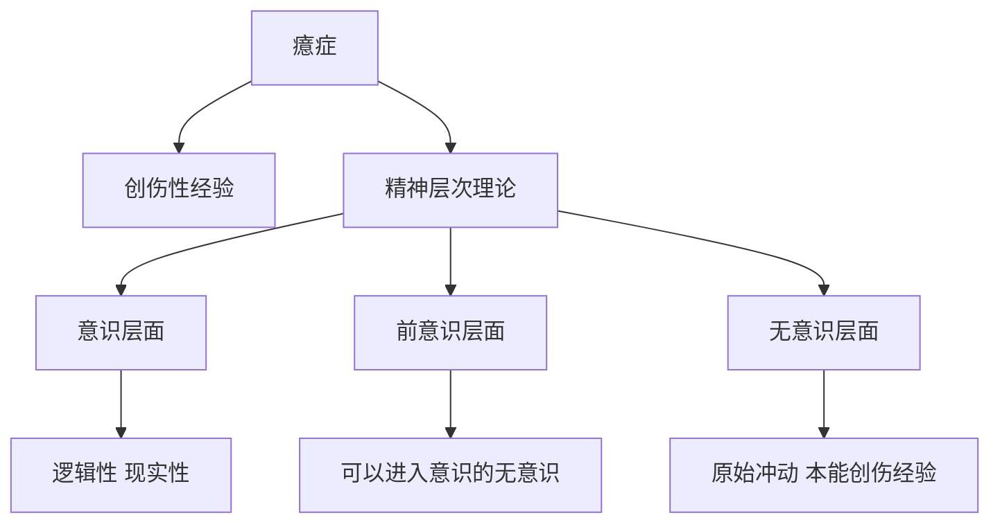

Yang Ning is a teacher in the Chinese Department of the China Institute of Labor Relations. Occasionally, I saw an article about him on Douban, and I became curious. From the afternoon of the weekend when the literary theory course was opened, I couldn't stop. These are some of the original notes I took during the lectures. I hope I will have the opportunity to study the Chinese Department in depth, which is a fascinating major.

## 文学理论（绪论）

## 何谓理论？

理论约等于哲学

对现象的抽象，分析，概括

### 深入思考的能力（反思，批判）

### 分析现象背后的本质（解读，阐释）

### 乔纳森~卡勒（什么是理论）

1. 理论是分析的话语

2. 理论是对常识的批评

3. 理论具有反射性，思维的思维
4. 理论是跨学科的

## 何谓文学理论

### 文学的“哲学”

文学理论是一种文学研究，需要冷峻的目光研究，而不是文艺的热爱。

（1）作者之意vs读者之意

作者对自己的作品是否有绝对的权威性？作者是否可能有可能写出作者自己都意识不到的内容？ 

一个优秀的小说，是对现实社会的真实反应，是不一人的意志为转移的。

（2）你是否看到一只鸡？

《电影的本性》

（3）随意解读vs科学解读

（4）阅读为何

1. 接受式
2. 反思式

反思式的阅读会一定成都上破幻接受式的审美体验。

1. 该哭哭，该审美审美
2. 去分析反思，获取第二重快感，这就是专业

### 评判作品背后的价值系统

中文系不培养作家，身份上很尴尬，哈哈

中文系是决定谁是作家的。

是裁判。

评价作品靠的是一整套理论，否则，就是通俗作家。

中文系主要课程：文学史，文学理论

文学理论决定了谁可以写进文学史。

文学理论在不同时代，是不断变动的。

李白，杜甫，苏轼，陶渊明   

个人喜好是没有标准的，而一部文学作品的评判，是有标准的。

不要以自己的喜好，来评论一部文学作品。

### 提供解读作品的角度、方法

所有的文学名著，两个特点：1,看不懂 ；2,没看过

看不懂，产生敬畏，其中必有深意，学习理论

一切的意义都是阐释的结果，没有阐释，就没有意义。

流浪地球：

- 好莱坞模式：最后一分钟营救、老者形象、寻父过程

- 男权主意

雅

俗

雅俗，体现了不同人的品味，甚至是阶层

看小时代，不需要有大量的知识储备，而百年孤独，是需要大量的知识储备。

### 文学理论具有跨学科性

学文学理论，往往需要借助其他学科的理论

- 哲学 （史铁生  存在主义哲学）
- 心理学 （文学本质就是在研究心理学）
- 语言学
- 社会学等等

耽美小说，同人等，反应了社会学中的什么呢？ 

以追求纯粹的爱情为初衷，最后爱情却沦为色情

## 文学理论的研究对象

“我从来不看国产剧”

英剧、美剧、韩剧、日剧、台剧、国产剧。 鄙视链

1. 文学四要素《镜与灯》




文学理论研究的五个方面：

- 文学本质论
- 文学创作论
- 文学文本论
- 文学接受论


# 第一章 文学本质论：文学是什么？

（文学与非文学的界限到底在哪儿？ ）

## 文学的“本质主意”与“反本质主义”

**本质主义：现象背后有本质**

**非本质主义：现象背后无本质**

本质是什么？物体之间的差异

**反本质不等于无本质**

追问==》文学本质：文学性（使得一部文学作品成为文学的特性）==》（俄国形式主义者，雅各布森）

## 文学性

（一）文学的存在方式（物质性的存在、**精神性的存在**）

> 文学的存在方式，是依据精神性的存在为依据的。

（二）文学性的四个维度

### 维度①：审美、文化

人类把握世界的三种方式：真善美

（1）文学与真==》真实==》不是与事实相符的真实，而是**真实感**

- 文学是为了求真吗？不是的。

（2）文学与善

- 《洛丽塔》《麦田的守望者》《安娜卡列尼娜》

- 日本电视剧《贤者之爱》

- 《红楼梦》薛宝钗与林黛玉，林黛玉真正体现了人性的光辉，我一我们喜欢她，符合审美的要求。而薛宝钗，是个完美的人，但是没有审美人味儿了。

（3）文学与美 

> 美，是文学的本质需求
>
> 区分两个概念：
>
> 美学：学科，研究审美活动的学科
>
> 审美：活动

**美的本质**是什么？（你跟实用性之间的距离产生了美）

​	无功利性

> 康德：判断力批判：美的四个方面定义（康德关于什么是审美）：
>
> - 无目的 的 合目的性（我想去欣赏的目的，并不是真的无目的，更高级，精神需求）
> - 无概念而具有普遍性
>
> 黑格尔《美学》：
>
> - 美是人本质力量对象化（本质力量：人区别与其他动物的本质，不能自己证明，只能通过客观事物来体现，譬如打水漂，画画）
> - 美是理念的感性显现（理念：理念，源自于柏拉图，「柏拉图，**洞喻**，我们看到的只是现象，背后是本质，本质就是理念；床喻」）


### 维度②：语言、符号

（1）语言的基本特征

1. 语言是一个符号系统

   > A. 索绪尔《普通语言学教程》关于语言学的简单三对概念
   >
   > > 能指：符号本身 
   > >
   > > 所指：符号的指称对象
   > >
   > > (语言符号具有任意性，但不必须约定俗成)
   >
   > > 语言：词汇系统，语法系统
   > >
   > > 言语：日常的个体语言活动
   >
   > > 组合：横向的句段关系
   > >
   > > 聚合：纵向的联想关系
   >
   > B.罗兰巴特《神话学》
   >
   > 能指	所指
   >
   > rose->玫瑰花
   >
   > 这是一个一级符号系统——能指——所指
   >
   > ​														  爱情
   >
   > 以一级符号系统作为能指，构成二级文化系统（文化）
   >
   > 
   >
   > 1979年  《枫》
   >
   > 
   >
   > C. 语言本身就是一个世界
   >
   > 汉语中，语音与文字时分开的，并非一体化。会造成符号本身的意义越来越多。
   >
   > 


   2. 语言与话语

        福柯（话语，法国人）《疯癫与文明》《规则与惩罚》《知识考古学》《词与物》 边心  （全景监视机制）

      > 语言：一个交际工具（现代汉语的研究范畴）
      >
      > 话语：语言的社会存在形态（语言文学的研究范畴）

      话语：

      - 说话人
      - 受话人
      - 文本
      - 沟通
      - 语境

   （2）文学语言与日常语言的区别

   > 文学语言的特点：
   >
   > 1. 文学语言是陌生化的语言；陌生化，俄国形式主义者（什克洛夫斯基）陌生化——自动化
   >
   >    我家门前有两棵树，一棵是枣树，另外一棵也是枣树。
   >
   >    （增长了感觉的时间和长度，难度加大了，有感觉了）
   >
   >    陌生化的本质：熟悉——陌生（增加感受时间，难度，文学是用来传递感受的）
   >
   >    （把某人打的表嵌入腕中）
   >
   >    方式：细节，想象细节的能力==对生活敏感
   >
   >    
   >
   >    张爱玲——半生缘
   >
   >    （顾漫真，绅士军；顾漫路，祝宏太；）
   >
   >    我本来以为我跟姐姐是不一样的人，没想到我只是比她慢了一步。
   >
   >    我发现，一直恨一个人，像一直爱一个人一样难。
   >
   >    自己的嘴唇沾到了自己的牙龈上
   >
   >    
   >
   >    看着那几个不认识的字，满心欢喜
   >
   >    
   >
   >    《最后的诊断》
   >
   >    
   >
   > 2. 文学语言具有非指涉性（伊戈尔顿）
   >
   >    指涉：一一对应
   >
   >    文学非指涉性：意义多一些，是歧义的
   >
   >    
   >
   >    红得像我的初恋一样的西红柿
   >
   >    文学语言的多义性：
   >
   >    > 语表的基体性
   >    >
   >    > 语里的多义性
   >
   >    
   >
   >    午梦初回，卷帘尽放春愁去
   >
   >    昼长无侣。自对黄鹂语。
   >
   >    絮影蘋香，春在无人处。
   >
   >    移舟去。未成新词。一砚梨花雨。
   >
   >    
   >
   >    《老人与海》《边城》
   >
   >    《赛鸽》
   >
   >    模糊的，矛盾的，越是直指人性的本质问题
   >
   >    
   >
   > 3. 文学语言具有拟陈述性（瑞恰兹）
   >
   >    **虚拟性，无关真伪**
   >
   >    **注重内在情感表现**
   >
   >    
   >
   >    送元二使安西
   >
   >    渭城朝雨浥轻尘，客舍青青柳色新，劝君更尽一杯酒，西出阳关无故人。
   >
   >    **更**
   >
   >    
   >
   >    江雪
   >
   >    千山鸟飞绝，万径人踪灭。孤舟蓑笠翁，独钓寒江雪。
   >
   >    
   >
   >    注重情感表现——
   >
   >    电视剧《人间四月天》
   >
   >    林：下雨了，你该回去了
   >
   >    徐：下雨了，再也回不去
   >
   >    
   >
   >    你怎么了？
   >
   >    没有啊，我只是渴了
   >
   >    
   >
   >    《泡在福尔马林里的时间》

   总结：

   文学语言与日常语言的区别：

   - 陌生化；自动化

   - 非指涉性；指涉性

   - 多义性；确定性

   - 虚拟性的；现实性的

   - 情感表现的；信息传递的

   - 内指性；外指性

   - 可感性；非可感性

   - 深度的语言；浅度

   - 生成性；惰性

     ……

     （3）文学对语言的超越
     
     ①
     
     - 言不及义《老子》
     - 得意忘言《庄子》
     - 文不达意《文赋》
     - 意翻空而易奇，言征实而难巧《文心雕龙》
     
     ②原因：
     
     - 语言：是具有公共性，交流性的
     
     - 思想：是个人性的，私人性的
     
     ③超越语言方案
     
     A、自动化写作：布勒东==》精神分析
     
     （自动化写作：意识流小说，意识的流动，对意识不加限制的自然记录下来）
     
     代表作：《墙上的斑点》《追忆似水年华》
     
     B、意生言外，象外之象
     
     不在于你说了多少，而在于你没说什么。

###维度③：情感，形象

（1）文学创作根本动机：抒情

（2）抒情方式：借助形象，意象的运用。

> 物象、意象、意境
>
> 物象——（情感）——意象——（情感）——意境

（3）形象：客观失误特征与主观情感特征结合

形象：具有概括性特征特征——（强化特征，激发联想）——读者自由创造联想和想象，激发读者的感受力

“秦时明月汉时关”，采用互文的手法，具有概括性，体现历史的沧桑感。

闻一多《死水》

舒婷《致橡树》

课堂提问：《木兰词》“东市买骏马，西市买鞍鞯，南市买辔头，北市买长鞭”。为什么不在一起买？不符合买东西的常识。
答：互文效果；准备很充分；在准备的过程中，有一种替父从军的自豪之感（仪式感，哈哈哈）；

贺知章《咏柳》
剪刀：体现了人民的有创造力的劳动
课堂提问：把春风比喻为剪刀，怎么好了？
答：剪刀和“不知细叶谁裁出”的“裁”字，符合期待，符合联想；“碧玉妆成一树高，万条垂下绿丝绦”，像姑娘。

###维度④：想象，虚构

许 荣 哲  台湾编剧 

迟到  有时候看似难以相信的故事也有可能是真的  外星人  秘密  讲座  追问答案  ：（故事的力量）

请假要有故事性，以强烈的代入感，从劣势说服对方。

**文学是一种假定的真实**

莱辛说：“艺术是一种逼真的幻觉”。

鲁迅小说，用第一人称写，我

阅读时，不要跟诗人较劲。不要遵从现实生活逻辑

张继《枫桥夜泊》“月落乌啼霜满天，江枫渔火对愁眠，姑苏城外寒山寺，夜半钟声到客船”。*（云公子，365读书，我听过）*

乌啼山；愁眠山；

乔布斯：显示扭曲力场

欧阳修：夜半钟声到客船，哪有寺庙半页敲钟；于是专家去考证了  挺笨的

**艺术的本质就是虚构，只要写的好，不需要合理**

王维《鸟鸣涧》【悦景春山空，人闲桂花落】桂花，花型极小，才有落地无声之感

世界三大戏剧理论体系：

>俄·斯坦尼斯拉夫斯基【《演员的自我修养》作者，强调演员要投入，必须有体验，才能有真实】
>
>德·布莱希特：【间离化：太逼真不好；**“打破第四堵墙”**，演员与观众之间的墙，演员要走到观众之中去，让观众感觉身处剧中。| 布莱希特认为，第四堵墙一定要存在，要有距离感】
>
>思考：是越真实越好吗？还是要有距离？


# 第二章 文学与世界

## 一、文学与意识形态

金庸   《神雕侠侣》小说比电视剧有意思的多。
杨过：聪明；勤奋刻苦；而忽略了杨过（长得帅）

### （一）文学在社会结构中的位置

> 上层建筑：
>
> - 观念上的上层建筑（政治；法制；道德；哲学；宗教；文学；艺术）
> - 实体性的上层建筑（军队；法庭；政府）、
>   
>
> 经济基础：
>
> - 生产力
>
> - 生产关系 

###（二）传统意识中关于意识形态的三种含义

1. 学科：18世纪  特拉西——观念学

2. 贬义：意识形态是一种**虚假意识**——**洗脑、控制**（马克思）
3. 中性：一种观念体系（马克思）

### （三）阿尔都塞的意识形态理论

阿尔都塞，西方马克思主义者，是对经典马克思主义的修正

> 当你指认出来谎言是谎言的时候，谎言已不是谎言了。
>
> 谎言，是此时此刻你正在坚信的东西

1970年《意识形态与意识形态国家机器》

1. > 区分一对范畴（国家机器——意识形态国家机器）
   >
   > 国家机器：军队，法庭，监狱等实体型的国家机器（暴力，可见，公共）
   >
   > 意识形态国家机器：宗教，教育，家庭，工会，传媒，文化，体育……（非暴力，隐形，私人领域）

**宗教**

*宗教借助仪式来建筑信仰*

*阿尔都塞：“不是因为你相信上帝，你才跪下，而是你跪下了，你才相信上帝”*

*现有仪式，才有仪式感*

*商品拜物教：我们想通过商品来定义自己是怎样的人。*

**教育**

升国旗仪式；

只有符合意识形态，才能考试得分

**家庭**

家庭对孩子意识形态，价值观的影响

其实，某种程度上，孩子还没出生时，就已经一定程度上确定了。

孩子的起名字中，也体现了意识形态。

*建国——文革——洁；白——博——叠词（小名就是大名）*

**传媒文化**

广告，买***使用价值***和***文化价值***（使看起来比较高级；明星同款，就比较高级）

2. 意识形态国家机器的功能和目的

   （1）自然化：天然如此，从来就是如此。用科学数据等来证明（值得我们去质疑）

   **科学只是阐释世界的一种方式而已。——杨宁**

   爱情，所指；那，能指是什么……指示不明

   看到社会现象时，要去挖掘背后的意识形态

   当钱成为衡量一切的标准时，便成了问题。

   关注诺贝尔奖的都是圈外人，颁奖标准是不被文学界主流认可的。

   人被异化，拜金主义到一定程度，过了合理的范畴。

   （2）合法化：

   历史都是胜利者书写的，所以历史都是当代史。

   *书写的是胜利者胜利的必然性和失败者的必然会性。会忽略掉很多复杂性的问题。*

   *争论背后的意识形态的体现*

3. 意识形态的运作方式：建构个体为主体

   **（1）核心：建构个体与现实的想象关系**

   ​	A. 把个体询唤为主体

   考不上大学后，就是一个个体，没有身份。有了身份，从个体变成了主体。

   企业文化培训后，我是公司的一份子，则建构了个体与现实的想象关系

   ​	B. 个体对主体的屈服 Subject

   入职时，要谦卑，认同

   ​	C. 主体与主体的互认

   大学生之间互相认同，抱团取暖

   别人骂中文系时，自己会有被骂的感觉，但确实对象时中文系，而不是你。

​	**（2）意识形象是一个“镜像序列”**

> 俄·拉康  “镜像阶段”
>
> 镜像阶段与镜像序列有什么关系呢？
>
> 6-18月，婴儿认不出镜子里的自己（**镜像阶段**）
>
> 18月以后，会兴奋，有控制感，因为可以控制镜像中的那个像
>
> 人通过对自我性格、能力的认知，都是通过一个个镜像来反馈，知道自己是一个什么的人。
>
> **意识形态是一个个镜像序列**

4. 意识形态没有历史

   从来如此，我们找不到意识形态是从哪里开始……

   找不到意识形态形成的过程。

### （四）症候阅读（挖掘作品中的意识形态）

> 作品中
>
> > 表层
> >
> > 深层的东西才是意识形态
>
> 症候，医学用语，通过表面症状，去看深层原因。

> 童话故事中的意识形态问题
>
> 《白雪公主与七个小矮人》
>
> 故事流程：
>
> 王后  产后  去世，后妈  ，继母（意识形态）
>
> 后妈：魔镜魔镜，谁是世界上最美的女人（后妈关注的是自己的外貌）
>
> 墨镜是站在一个男性的视角来观察的
>
> 后妈开始追杀公主（女人之间很残忍，男人见女人心软）
>
> 后妈开始自己去
>
> snow white dead
>
> 王子看到了尸体，“好美啊，亲吻了一下尸体”，白雪公主醒了
>
> （女孩你需要美就够了）
>
> 白雪公主形象：没有思考，没有判断，没有主动，傻白甜
>
> 建构了  什么是美的意识形态
>
> 
>
> 《灰姑娘》《海的女儿》
>
> 女孩儿不要太主动，欲擒故纵……

> 影视作品对意识形态
>
> 《2012》
>
> 豆瓣：2012中国拯救了世界
>
> 国人的谄媚  对美国梦的崇拜
>
> made in china
>
>
> 《我不是药神》
>
> 太商业片
>
> 后期，过后过于描述个人英雄主义
>
> 削弱了社会问题的内涵
>
> 
>
> 《金陵十三钗》
>
> 讨厌的原因
>
> 1.典型的汉奸电影
>
> 给西方的白人看  张艺谋  冲击西方奥斯卡
>
> 西方白男人形象
>
> 2.林志玲结婚
>
> 民族主义情绪干涉进来了
>
> 用女性身体被玷污来体现民族仇恨
>
> 妓女换女学生，你们已经是妓女，已经受过一次伤害，再多一次也无妨。


## 二、再现与模仿（世界=自然=现实生活）

### （一）作为艺术理论的“再现”（表征）

#### 1.  再现：外部事物在作品中的呈现

艺术再现的原因，事物当时不在场

####2.  “再现”涉及的几个因素

#####（1）媒介及其文化规定

- **媒介**

越真实，越有欺骗性。

所谓，无图无真相。画框的呈现，选择性呈现

但我们总有一种感觉，图像更真实，是这样吗？

电影和小说，媒介不同，所以有极大不同。

创作者对自己小说的阐释，只是另一种媒介而已，也是另外一种再现，也是不真实的。所以必定失真。

- **文化规定**

艺术水准高的，几乎不用背景音乐。*我想到了希腊电影《情不知所起，一往而深》和冰岛电影《处子之山》*

《暮光之城》与其他吸血鬼电影

李安《色戒》

莫言《红高粱》张艺谋

##### （2）再现的编码层面——文本

文本细读：文本背后的（形式，结构，修辞，音乐）

#####（3）再现的社会层面——生产机制

从**文化生产**、**文化消费**的角度研究作品

有些作品是为了流行而写作

譬如，巴尔扎克，为了稿费，写一些简短的精彩小说

村上春树——通俗性文学写作；类比郭敬明 pro升级版

### （二）模仿说与镜子说

#### 1.  模仿说

#####（1）柏拉图：“床喻”

床本身就是一个模仿，工匠从自己思维中的理念中的床的概念打造了现实的床。

- 理念世界——真实存在

- 现实世界——对理念的模仿

- 艺术世界——模仿的模仿（柏拉图认为艺术世界地位是低的，低级的）

  ----

  问题：

  1. 忽略艺术家的创造力

  2. 模仿的对象到底是【表象/本质】，柏拉图认为是表象

     > 柏拉图建立了一个二元世界
     >
     > 原本——摹本
     >
     > 世界——艺术

#####（2）亚里士多德《诗学》

*建议大家人手一册*

*《诗学》《说文解字》《文心雕龙》*

- 创作过程是模仿过程

- 现实生活：个别与一般的结合

  ==》他认为：

  **诗比历史更真实（诗，广义理解为一切艺术，文学）**

  - 诗，描述可能发生的事情——本质的规律

  - 历史，描述已经发生的事情——个别的，特殊的规律

#### 2.  镜子说

文艺复兴时期，达芬奇

——>绘画：艺术就是一面镜子

——>文学：用语言影射自然

——>艺术水平/ 模仿的准确度成正比

——>真理符合论  【把真等同于美】

### （三）现实主义和自然主义

#### 1.  现实主义：18世纪末19世纪初

文学作品对现实能动的反应和再现

==>揭示社会生活的本质规律

#### 2.  自然主义：19世纪后期

强调“客观的真实”，“科学的真实”

文学对自然无条件的复制，记录

特别注重环境描写

代表作家：**佐拉**

## 三、表现与抒情（世界——情感）

（我想到了初二时，语文老师说，黄河，你为什么这么长，我好爱你啊）

### （一）作为艺术理论的“表现”（寓意）

#### 1.强调情感表现，主观情感表现，自我内心体验的表达

意大利 克罗齐：直觉即表现

#### 2.突出了一种个性创造力，想象能力，甚至某种天赋在文学作品中的作用

核心：主体的创造能力（柏拉图：迷狂状态）

抒情的自我表现，蕴含着一定的社会内涵。(社会内涵，透漏着某种评价，信仰，理想)

#### 3.抒情需要创造性的选择组织抒情话语

抒情：

1. 第一步，超越原发情感（感受你的感受），抒情是情感的释放，但又是情感的构造。构造的本质是构造意象。

   （1）直接抒情、间接抒情

   间接抒情，通过意象，例如借景抒情

   直接抒情，抒发出人类的共通感。

   《登幽州台歌》通篇直接抒情，没有借助意象，前不见古人后不见来者，念天地之悠悠，独怆然而涕下。

   （2）抒情与宣泄的区别

   - 抒情：是情感的建构者（自由）
   - 宣泄：主体完全沉浸在情绪之中、（不自由）

   （3）抒情的表现方式：构造**抒情话语**

   **抒情话语**的本质：不追求话语表面的真实，而追求情感的真实。（在逻辑上是说不通的，但是在情感上是说得通的；所谓，无理而妙）

   > 海明威 《白象似的群山》
   >
   > “你看，远处好像一群白色的群山……”
   >
   > “像吗？”
   >
   > “你当然不会觉得像的。”

   

   C

   

   BE

#### 4.抒情与再现

##### （1）抒情的本质是一种再现

​	再现：外部世界，和内心世界

#####（2）抒情是一种特殊的再现

 1.  再现社会生活精神方面

 2.  抒情对客观世界的再现具有**主观性**

     王国维《人间词话》

     > 有我之境
     >
     > 无我之境

 	3. 抒情对客观世界的再现具有某种**评价性**

### （二）浪漫主义、唯美主义

#### 1. 浪漫主义：19世纪上半叶

浪漫主义的实质：艺术再现作家的内心世界

强调情感，想象，激情，创造，自由

#### 2.唯美主义：19世纪后半叶

为艺术而艺术

实质：生活=艺术

强调：艺术就是为了再现自身

导致**美和真**关系发生变化

### （三）文学与真实

#### 1. 真实的含义：符号模仿某个对象的逼真程度

#### 2.文学真实的三个方面

#####（1）作品与世界的关系：作品与外部世界的符合度——现实主义

#####（2）作品与作者的关系：作者创作初衷，创作动机的真与假——作家的责任与道德

##### （3）作品与读者的关系：读者个体经验差异

####3.文学真实与生活真实

##### ①生活制约文学

##### ②文学超越现实生活

真实感

《河的第三条岸》

很荒谬，但还很有意思，比较难懂

文学真实感问题：诗意的真实

​									失实的表象——真实的哲理

《堂吉诃德》

《哈姆雷特》

《一千零一夜》

印度两大史诗

主人公读到故事本身

**博尔赫斯**、马尔克斯、乔伊斯

博尔赫斯——《小径分叉花园》

 《车站》

##### ③现实生活对艺术模仿

好莱坞与911

#### 4. 文学真实与情感真实（作品的作者）

##### （1）作者情感经验是作品细节真实保证

##### （2）作者的情感经验不等于作品的文学作品真实

##### （3）创作动机的“真诚”不等于作品真实

#### 5. 文学真实与读者经验（作品和读者）

《鬼子来了》不真实，因为里面的日语极为标准，而没有带脏字，口音等


## 四、形式与结构（“世界”即“文本”）

结构主义思潮：文学作品，有内在的共通结构

目标——阻碍——努力——结果——意外——转弯——结局

《八十天环游地球》

目标——因为

阻碍——但是

努力+结果——所以

意外+转弯——但是

结局——所以

### （一）叙事语法：“叙事作品是一个大句子”

1. 罗兰巴特《叙事作品结构分析导论》
2. 妥多洛夫《文学作品的分析》

###（二）普罗普：故事形态学

《民间故事形态学》（1928年）

引用功能，7个角色

①对手 （加害者）

②赠与者（提供者）

③相助者（帮手）

④公主（要找的人）

⑤派遣者

⑥主人公

⑦假冒的主人公

### （三）格雷马斯的结构语义学

1. 六个行动模型

   发送者——客体——接受者

   ​                     |

   辅助者——主体——反对者

2. 符号学矩阵

   

《老人与海》

要素：老人，海，鱼，他人

X：老人                反X：他人

​		个体								群体


非反X：海            非X：鱼（老人与鱼，是人与自然的关系（绝对的自然）											杀戮）


①个体与群体——自我确定

②人与自然——优胜略汰

③时间意义——人生的价值

（老人是胜利还是失败）

 ### （四）克洛德布雷蒙“三合一体”模式

《叙事可能之逻辑》

三合一体：

1. 情况形成——提出一个问题
2. 采取行动——给出一个解决方案
3. 目的达成——结果


①链接式 A1-A2-A3-B1-B2...

典型代表：侦探小说

②镶嵌式

典型代表：《水浒传》

③两面式

典型代表：水浒传，智取生辰纲

### （五）托多洛夫的叙事语法研究

《叙事作为话语》


​									（原有平衡）

​												|

​	破坏性的力量<——平衡破坏——>对抗

​												|

​										新的平衡

​												|

​											……

### （六）列维斯特劳斯 《神话结构》


---


# 第三章  文学与文本

## 一、叙事性文本的形式问题与审美问题

情节——两难

### （一）叙事性文本的形式问题

叙事：用话语虚构社会生活的过程

内容：社会生活、方式：话语

#### 1. 叙事视角：

《最后一片叶子》欧亨利  苏  琼西  贝尔

《看不见的珍藏》茨威格  老人  儿女  **商人**

**叙事者、作者、人物、读者**

传统：谈人称 （谈人称的切换）

- 第一
- 第二
- 第三

> 高行健 **《母亲》**《名山》《车站》……
>
> 《呼啸山庄》勃朗特三姐妹
>
> 《黑暗的心》

**叙事视角都有那些？**

（1）外视角：观察者处于故事之外

​		A. 全知视角：

​		B. 选择性全知视角：限制自己的观察范围，仅是描写某一个人物的视角

> 《小事情》 台湾作家

​		C. 限制性客观视角（摄像式）

> 海明威 《杀人者》
>
> 能用动词和名词解决的绝不用形容词，简练。
>
> 海明威从来不做心理描写
>
> 海明威让他儿子写小说，用吐格涅夫的小说。需要改一些。All of sudden.  Suddenly

​		D. 第一人称主人公回顾性视角

> 【奥地利】 斯台芬·茨威格 《一个陌生与人的来信》

​		E. 第一人称叙述见证人的旁观视角

> 【美】舍伍德·安德森《林中之死》

（1）内视角： 观察者处于故事之内

​		A. **固定式**人物有限视角

​		B. **变换式**人物有限视角

> | 过程一 | 过程二 | 过程三 |
> | :----: | :----: | :----: |
> | A视角  | B视角  | C视角  |
>
> 弗吉尼亚·伍尔夫  《到灯塔去》（哈哈，李敖讲过，可是我没看过）

​		C. **多重式**人物有限视角

> |           过程一            |
> | :-------------------------: |
> | A视角<br />B视角<br />C视角 |
>
> 黑泽明《罗生门》改编自  芥川龙之介《竹林中》
>
> | 罗生门                             |
> | ---------------------------------- |
> | 武士<br />妻子<br />多香丸（强盗） |

​		D. 第一人称叙述的体验视角

​	（放弃观察视角，以第一人称角度进行感受）

（3）热奈特《叙述话语》（概括了上述的九种视角）

​		A. 零聚焦，叙述者大于人物

​		B. 内聚焦，叙述者只能说出某个人物的请况，叙述者等于人物

​		C. 外聚焦，不透视内心（海明威），叙述者小于人物

#### 2. 叙事时间：

##### （1）故事和情节

> 【英】福斯特《小说面面观》
>
> {
>
> 故事：国王死了，王后也死了（按时间顺序）
>
> 情节：国王死了，王后因悲伤过度也死了（按因果逻辑）
>
> }
>
> ---
>
> 安徒生 《老头子做事总不会错》（哈哈哈，我听过）
>
> ---
>
> 【英】S.J.沃森《别相信任何人》
>
> “别相信本……”

##### （2）时序

> 【哥伦比亚】加西亚·马尔克斯《百年孤独》
>
> “多年以后，奥雷联诺上校站在行刑队面前，准会想起父亲带他去参观冰块的那个遥远的下午。”
>
> | 过去 | 现在 | 未来 |
> | ---- | ---- | ---- |
> |      | ①    |      |
> |      |      | ②    |
> | ③    |      |      |
>
> （A）倒叙
>
> 好处是什么？
>
> 1234567
>
> 2345671
>
> 7123456
>
> 都属于倒叙
>
> ---
>
> 余华《十八岁出门远行》
>
> 余华写作风格：人性悲凉
>
> 开头：
>
> “柏油马路起伏不止，马路像是贴在海浪上。我走在这条山区公路上，我像一条船。
> 这年我十八岁，我下巴上那几根黄色的胡须迎风飘飘，那是第一批来这里定居的胡须，
> 所以我格外珍重它们，我在这条路上走了整整一天，已经看了很多山和很多云。所有的
> 山所有的云，都让我联想起了熟悉的人。我就朝着它们呼唤他们的绰号，所以尽管走了
> 一天，可我一点也不累。我就这样从早晨里穿过，现在走进了下午的尾声，而且还看到
> 了黄昏的头发。但是我还没走进一家旅店。”
>
>
> 结尾：
>
> “ 天色完全黑了，四周什么都没有，只有遍体鳞伤的汽车和遍体鳞伤的我。我无限悲
> 伤地看着汽车，汽车也无限悲伤地看着我。我伸出手去抚摸了它。它浑身冰凉。那时候
> 开始起风了，风很大，山上树叶摇动时的声音像是海涛的声音，这声音使我恐惧，使我
> 也像汽车一样浑身冰凉。
>   我打开车门钻了进去，座椅没被他们撬去，这让我心里稍稍有了安慰。我就在驾驶
> 室里躺了下来。我闻到了一股漏出来的汽油味，那气味像是我身内流出的血液的气味。
> 外面风越来越大，但我躺在座椅上开始感到暖和一点了。我感到这汽车虽然遍体鳞伤，
> 可它心窝还是健全的，还是暖和的。我知道自己的心窝也是暖和的。我一直在寻找旅店，
> 没想到旅店你竟在这里。
>   **我躺在汽车的心窝里，想起了那么一个晴朗温和的中午，那时的阳光非常美丽。我
> 记得自己在外面高高兴兴地玩了半天，然后我回家了，在窗外看到父亲正在屋内整理一
> 个红色的背包，我扑在窗口问：“爸爸，你要出门？”
>   父亲转过身来温和地说：“不，是让你出门。”
>   “让我出门？”
>   “是的，你已经十八了，你应该去认识一下外面的世界了。”
>   后来我就背起了那个漂亮的红背包，父亲在我脑后拍了一下，就像在马屁股上拍了
> 一下。于是我欢快地冲出了家门，像一匹兴高采烈的马一样欢快地奔跑了起来。**”
>
> 倒叙
>
> （B）插叙

##### （3）时距

> {
>
> 故事时间——自然时间
>
> 话语时间——文本时间
>
> }

（A）话语时间小于故事时间

——概述

> 《木兰辞》十年时间——万里赴戎机

常用在背景交代

> 《赖索》黄凡  经典的转场

（B）话语时间等于故事时间

——场景

舞台表演

（C）话语时间为零，故事时间无穷大

——省略

（D）故事时间为零，话语时间无穷大

——停顿

> 《追忆似水年华》

##### （5）频率

A. 单一叙述

B. 重复叙述（讲述多次发生一次的效果《祝福》鲁迅）

> 史铁生《命若琴弦》
>
> 开头与结尾

C. 概括叙述

#### 3.叙事交流

布思《小说修辞学》——叙事交流的三个要素：作者、作品和读者

查斯曼《故事与话语》——叙事交流图

```flow
st=>start: 真实作者
op1=>operation: 隐含作者
op2=>operation: 叙述者
op3=>operation: 受述者
op4=>operation: 隐含读者
e=>end: 真实读者
st(right)->op1(right)->op2(right)->op3(right)->op4(right)->e
```

中间的环节都属于文本

##### （1）真实作者与隐含作者

{

**真实作者**：就是日常生活中的人——通过传记

**隐含作者**：作家创作时，处于某种创作状态，出于某种立场的作者——通过作品理解读者

- 隐含作者可以有多个
- 所谓文不如其人

**隐含读者**：作者创作时预设的读者——理想读者（接受式的阅读）

反思式阅读（某种意识形态，要惊醒，要对抗意识）

}

##### （2）叙述者和受述者

{

**叙述者：**不一定有人格化特征，不是以人格化的存在。接近于**主语**。

> **叙述者与故事的关系**
>
> 1. 故事内叙述者——作品中的人物
> 2. 故事外叙述者——摄像式的叙述
> 3. 亚故事叙述者——

**受述者：**约等于**宾语**。隐含的读者

> 《寒冬夜行人》

}

###（二）叙事性作品审美问题

| 小说三要素 |                      |
| ---------- | -------------------- |
| 人物       | 形象——性格、情感     |
| 情节       | 因果——情感、审美逻辑 |
| 环境       | 典型环境             |

> 科幻小说：由科技发展逻辑推动情节逻辑。人物就不饱满。

#### 1. 人物：情感的多元错位

##### （1）人物形象的复杂性问题

（高雅）作品——人生、人性，社会复杂性——冲击你原有的价值观念——人物形象塑造——赋予原因，坏的过程，为什么坏

京剧艺术看的是表演，而不是内容，与小说看内容有些差别。

| 概念     | 福斯特在《小说面面观》提出     | 沃伦补充     | 作用     |
| -------- | ------------------------------ | ------------ | -------- |
| 扁平人物 | 性格单一，缺少变化             | （静态人物） | 容易识别 |
| 圆形人物 | 性格充满变化，多种性格因素人物 | （动态人物） | 接近真实 |

没有简单的优劣之分

##### （2）人物情感：突破常态心理，情感

###### A. 挖掘人物潜在情感

> 不能让郎平演郎平，因为潜在的情感发现不了

###### B. 人物关系亲密程度与人物情感形成反差

> 托尔斯泰 《复活》聂赫留朵夫与卡秋莎·玛丝络娃
>
> ---
>
> 《西游记》三打白骨精  面对妖怪，师徒四人的态度是不一样的。
>
> ---
>
> 《黄思琪的初恋乐园》
>
> 心理状态：被老师玷污后，恨，说服自己爱上老师。

###### C. 叙述者与人物拉开距离

不可抗的叙述者

> “我是唯一逃出来向您报信的人”
>
> 《少年派的奇幻漂流》

##### （3）人物性格：理性与感性

*人始终是感性的动物，感性大于理性*



鲁迅：状诸葛多智而近妖

> 欧亨利《一个忙碌经纪人的求婚仪式》


#### 2. 情节：把人物打出正常轨道

  ##### （1）矛盾冲突：冲击常态情感——情节

> 童伟格《我》

冲击人物的情感结构（让表层情感结构瓦解，让深层情感结构显现）

##### （2）因果关系——审美因果，超越于实用因果

> 世说新语
>
> 王羲之儿子
>
> 尽兴而来，乘兴而归

A. 情节的动因遵循情感逻辑

B. 情节的有机性、严密性

> 红楼梦：倩雪——
>
> 曹禺《雷雨》：周通  

C. 情节是为了性格展开而服务

> 武松打虎
>
> 三碗不过岗
>
> 多次劝说
>
> 政府公文
>
> 【要面子，要强，固执偏执】最后被逼出勇敢
>
> ---
>
> 三国演义
>
> 周瑜——草船借箭
>
> 嫉妒产生于 能力差不多，关系密切之间
>
> 周瑜的嫉妒逼出诸葛亮的草船借箭
>
> 既生瑜何生亮

#### 3. 环境：

##### （1）人物与环境的关系

——促进与被促进的关系

经常说：典型的人物



##### (2)外因与内因关系

> 人性本善还是人性本恶
>
> 恶：如果是人性本善的，那谁是第一个教人恶的呢？



##### (5)环境的淡化（现代主义）

目的：表现人类普遍精神状态

呈现出人的自然属性（人的本能状态）

> 卡夫卡《变形记》《城堡》

## 二、抒情性作品的结构问题和审美问题

（诗歌和散文）下学期讲

> 叙述性  小说和戏剧文学的起源问题

## 三、文学文本的层次

**文本层次**

| 概念           |                                                  |
| -------------- | ------------------------------------------------ |
| 文本（Text）： | 具有相对独立性——意义：作者与读者之间（文本间性） |
| 作品：         | 作品从属于作者——意义：作者                       |

文本，不考虑作者的创作意图

作品，要考虑作者的创作意图

文学理论——文本——内容+形式

> 散文：形散而神不散 （屁话），没有体现出散文的特点

### （一）“二分法”

**文质**

| 二分法                                           |
| ------------------------------------------------ |
| 内容：素材、主体、题材（主体类型，就内容而言）   |
| 形式：语言、技巧、结构、体裁（诗歌，小说，散文） |

**问题：**二者不可割裂，无法对文学理论的进一步研究

### （二）超越“二分法”——层次论

#### 1. 【英】贝尔“有意味的形式”《艺术》

> mass: 大众；质量；弥散曲

贝尔认为：艺术就是形式，比不过是有意味的形式

意味：内容 

如果过分重视形式，会走向“形式主义”的极端

#### 2. 新批评：

① 声音层面

② 意义单元：语言结构、风格

③ 意象和隐喻：

④ 象征系统中呈现的“世界”

⑤ 形式、技巧……

> 新批评，强调文本批评的实践

#### 3. 现象学

①【法】杜夫海纳《审美经验现象学》

三分法

材料——主题——表现

②【波兰】英伽登

1. 语词声音和语音结构——语言
2. 意群：句子，意群——语义
3. 图示化外观——语言描绘
4. 被再现实体——意义

#### 4. 中国古代文论

《周易》——

1. 言——语言
2. 象——意象
3. 意——意境

> 《文心雕龙》 第一次提出  意象
>
> 意境 王昌龄  《诗格》

### （三）文学文本的层次

#### 1. 语言层（言语层）

1. 功能：

   - 审美意识符号化

   - 语言本身有审美特性

2. 特点：

   参考教材

   内指性，指向情感

   陌生化

#### 2. 现象层：

1. 功能：现象是文学的本质的标致
   - 非文学：语言——意义
   - 文学——形象——意义

2. 特点：

#### 3. 意蕴层

1. 特点 

   多义性

   “岱宗夫如何，齐鲁青未了。造化钟神秀，阴阳割昏晓”

   3个层面


# 第四章  文学与作者

## 一、佛洛依德的精神分析论

### （一）意识与无意识



### （二）弗洛伊德式失误

应用

#### 1. 失误行为

#### 2. 诚实的不诚实

#### 3. 癔症转移

### （三）人格结构理论

#### 1. 第一个问题

1. **超我** = 遵循求善的原则（容易抑郁，思想负担太重）——**三个层面都有**
2. **自我** = 现实原则——**意识、前意识**
3. **本我** = 遵循享乐原则（容易犯罪）——**无意识层次**

（哈哈，香蕉道具出现  第25集）

#### 2. 本我——本能

1. | 本能                                   |
   | -------------------------------------- |
   | 生的本能——物种延续                     |
   | 死的本能——回到原始状态，在母体中的状态 |

   死的本能，人是有破坏欲的

   > 巴黎圣母院失火
   >
   > 烧的好
   >
   > 不能说
   >
   > 谁让你们烧我们圆明园

2. 力比多（弗洛伊德把生的本能叫做力比多）

   力比多的发版阶段

   A. 自恋期

   - 0~1 口腔期
   - 1~3 肛门期（如果不满足，有洁癖）
   - 3~5 生殖崇拜期 （开始意识到自己是有生殖器官的）
     - 男孩：恋母情节（俄利普斯情节，杀父娶母；仇恨父亲，喜爱母亲；犯错时，在父权权威下，变成女孩，阉割焦虑）
     - 女孩：恋父情节（俄勒克特拉情节；女儿为父复仇；自己在照镜子时，发现自己不完整，是阉割的男子；阴茎嫉妒；）

   B. 潜伏期

   - 6~12 超我大发展的时候

   C. 生殖期

   - 13~ 青春期，转移到异性身上

### （四）梦的解析（1900《释梦》）

书虽然很厚，但是很有意思，有大量的梦的情节

> 在弗洛伊德之前，人们怎么看待梦？
>
> 梦是一种预兆
>
> 《法治进行时》通过梦来传达一些信息，通常是在亲人之间发生。

#### 1. 基本观点

梦是有意义的——跟人清醒时的活动有关联

梦（梦的本质）：**梦是愿望的达成**，这个愿望往往是被压抑的愿望的满足。

> 弗洛伊德——阿德勒——隆德——拉康
>
> 要考上研究生，皓首穷经！

梦，是愿望的达成。只不过，成人的梦比较复杂。成人即便是在做梦，也是被压抑的，要经过伪装

---

#### 2. 梦的四种伪装手段

##### （1）浓缩作用 （小学，初中，高中同学坐一桌，互相认识）

##### （2）移置作用（将愿望移到无关紧要的事物上）

##### （3）象征作用（抽象的东西变具体；雨伞、钢笔——男性象征；洞穴，罐子——女性象征；楼梯；桃花源记是陶渊明的性的想象；邱水堂解读《金瓶梅》）

##### （4）润饰作用 （融合以上的所有伪装，使看起来自然，通过梦的审查机制）

#### 3. 解梦

1. 记录梦，将梦拆分为不同部分
2. 针对各部分，展开自由联想
3. 追述现实生活中的来源
4. 找出之间的内在联系
5. 发现做梦者的真实愿望（焦虑，病痛就消失了）

### （五）《作家与白日梦》

1. 白日梦——想象

   ​		|

   未满足的愿望——文学

   > 作家的白日梦
   >
   > 张贤亮

2. 升华理论

   文化转移——文学、艺术

   本能欲望的升华的体现

   > 案例《哈姆雷特》弗洛伊德的解读
   >
   > 文艺复兴时期的忧郁王子；王子复仇记
   >
   > 哈姆雷特为什么不去复仇？文艺复兴，要正当，所以要决斗
   >
   > 俄利普斯情节，哈姆雷特杀死自己的叔叔，类似于杀死自己的父亲——作者研究（莎士比亚，在自己父亲去世后，写的《哈姆雷特》）

### （六）精神分析批评

#### 1、分析作品创作心态

##### （1）搜寻作家的相关资料

信件，日记，手稿，作家年经理

> 《黑猫》
>
> 史铁生作品中，残疾人形象很多
>
> 莫言 跟母亲 去地里捡麦穗 《丰乳肥臀》先给母亲，莫言的恋母情节

##### （2）对作品做症候式解读

> 简奥斯汀《艾玛》

### 2、分析作品的潜在意义

> 《春阳》中一个人物 缠姨
>
> 《红楼梦》小楼一趴若相思

精神分析方法给了作品分析的另一个空间，是一个大的宝库，大的世界


弗洛伊德 揭示了 无意识领域； 弗洛伊德在 文学艺术领域，可阐释性极大。

精神分析博大精深，以上只是1.0版本


## 二、荣格的原型理论

### （一）人格结构理论

> 你看太阳垂下了一根管子，像生殖器一样。
>
> 引起了荣格的注意。
>
> 可能无意识，不是来自于个人，而是来自于原始人类集体的沉淀。
>
> 我们怕黑，可能跟原始人类的远古经验有关。
>
> 对于动物不是一视同仁的，譬如对于蛇和兔子。
>
> 密集恐惧症
>
> 怕腐烂的东西

> 生物学佐证：高等动物保存低等动物全部的生物信息

1. 自我意识
2. 个体无意识
3. 集体无意识——由遗传保留下来的普遍心理经验

**集体无意识**包含两个方面的内容：

| 集体无意识                               |
| ---------------------------------------- |
| 本能——与生俱来（弗洛伊德）               |
| 文化——文化形成普遍存在于意识深处（荣格） |

### （二）原型——集体无意识的呈现形式——原始意象

提出原型概念

原型：集体无意识的呈现形式，我们看不到，但可以感知到。从远古以来长期积累的一种经验

可以揭示很多病例，很多的巧合

**代表原型**

1. “阴影”和“人格面具”

   阴影：动物性，邪恶性；余生具有

   人格面具：按照社会的期待，人格外在假象。也是余生具有的

2. “阿尼玛”和“阿尼姆斯”

   阿尼玛：男性内心中某种女性特质的体现

   阿尼姆斯：女性内心中男性特质的体现

3. 智慧老人——智慧的形象化

   原始人，对智慧是有追求的。

   > 尼采的《查拉图斯特拉如是说》
   >
   > 《三国演义》诸葛亮  多智而近妖；但老百姓喜欢，源于诸葛亮符合 智慧老人的形象。
   >
   > 《哈利波特》邓布利多

4. 母亲——包容，慈善，关怀；权威

可能指的是，女神——大地——泉水——伊甸园——天国

也可能是，巫婆——魔女——棺材——深渊——噩梦

5. 儿童——自我潜能，拥有极强的可能性

   哪吒、工藤新一、一休

作者在创作是，不自觉的受集体无意识的影响。


### （三）原型批评

#### 1、创作角度

文艺作品就是作家的自主情节，包括两部分内容：

1. 作家自己意识
2. 集体潜意识

艺术创作的动机：集体无意识

作家只是集体无意识的代言人

（有点否定作家的自主创作的能动性）

作家：

1. 作为个人的作家——自主意识——个人

2. 作为作家的个人——集体无意识——集体人

   > 歌德《浮士德》

好的作家能写出“集体人”，包含大量集体人的，是好作品。

#### 2、接受角度

发现作品中反复呈现的一些叙事结构和人物形象象征

——重新构建出原始意义

——进而发现人类的本质，即艺术的本质


_The end_


