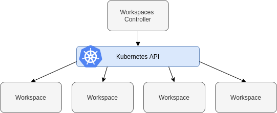
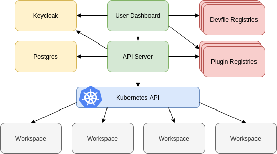
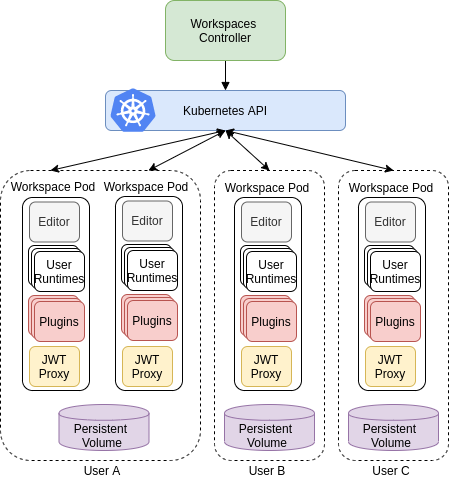

# Introduction to Eclipse Che*介绍*

- A centralized developer environment running on Kubernetes or OpenShift.*-在Kubernetes或OpenShift上运行的集中式开发人员环境。*

- A multicontainer workspace for each developer with the ability to replicate with a single click using Eclipse Che factories.*-每个开发人员的多容器工作区，能够使用Eclipse Che工厂单击一次进行复制。*

- Pre-built stacks with the ability to create custom stacks for any language or runtime.*-预先构建的堆栈，能够为任何语言或运行时创建自定义堆栈。*

- An enterprise integration that uses Keycloak for Active Directory (AD) database and Lightweight Directory Access Protocol (LDAP) related actions.*-使用Keycloak进行Active Directory（AD）数据库和轻型目录访问协议（LDAP）相关操作的企业集成。*

- Browser-based IDEs; integration with Che-Theia or any other web IDE, such as Jupyter.*-基于浏览器的IDE； 与Che-Theia或任何其他Web IDE（如Jupyter）集成。*

- Support of tooling protocols, such as the Language Server Protocol or Debug Adapter Protocol.*-支持工具协议，例如语言服务器协议或调试适配器协议。*

- A plug-in mechanism compatible with Visual Studio Code extensions.*-与Visual Studio Code扩展兼容的插件机制。*

- A software development kit (SDK) for creating custom cloud developer platforms.*-用于创建自定义云开发人员平台的软件开发套件（SDK）。*

  

## Getting started with Che*入门*

### What is Eclipse Che  *什么是Eclipse Che。*

Eclipse Che is a Kubernetes-native IDE and developer collaboration platform.

> Eclipse Che是Kubernetes的本地IDE和开发人员协作平台。

As an open-source project, the core goals of Eclipse Che are to:

> 作为一个开源项目，Eclipse Che的核心目标是：

- **Accelerate project and developer onboarding:** As a zero-install development environment that runs in your browser, Eclipse Che makes it easy for anyone to join your team and contribute to a project.

  > **加快项目和开发人员的使用速度：**作为在您的浏览器中运行的零安装开发环境，Eclipse Che使任何人都可以轻松加入您的团队并为项目做出贡献。

- **Remove inconsistency between developer environments:** No more: “But it works on my machine.” Your code works exactly the same way in everyone’s environment.

  > **消除开发人员环境之间的不一致：**不再：“但是它可以在我的机器上工作。” 您的代码在每个人的环境中的工作方式都完全相同。

- **Provide built-in security and enterprise readiness:** As Eclipse Che becomes a viable replacement for VDI solutions, it must be secure and it must support enterprise requirements, such as role-based access control and the ability to remove all source code from developer machines.

  > **提供内置的安全性和企业就绪性：**随着Eclipse Che成为VDI解决方案的可行替代品，它必须安全并且必须支持企业要求，例如基于角色的访问控制和删除所有源代码的能力 从开发人员机器。

To achieve those core goals, Eclipse Che provides:

>  为了实现这些核心目标，Eclipse Che提供了：

- **Workspaces:** Container-based developer workspaces providing all the tools and dependencies needed to code, build, test, run, and debug applications.

  > **工作空间：**基于容器的开发人员工作空间，提供了编码，构建，测试，运行和调试应用程序所需的所有工具和依赖项。

- **Browser-based IDEs:** Bundled browser-based IDEs with language tools, debuggers, terminal, VCS integration, and much more.

  > **基于浏览器的IDE：**具有语言工具，调试器，终端，VCS集成等等的基于浏览器的捆绑IDE。

- **Extensible platform:** Bring your own IDE. Define, configure, and extend the tools that you need for your application by using plug-ins, which are compatible with Visual Studio Code extensions.

  > **可扩展的平台：**带上自己的IDE。 通过使用与Visual Studio Code扩展兼容的插件，定义，配置和扩展应用程序所需的工具。

- **Enterprise Integration:** Multiuser capabilities, including Keycloak for authentication and integration with LDAP or AD.

  > **企业集成：**多用户功能，包括用于身份验证和与LDAP或AD集成的Keycloak。

### Workspace model  *工作空间模型*

Che defines the workspace to be the project code files and all the dependencies necessary to edit, build, run, and debug them. Che treats the IDE and the development runtime as dependencies of the workspace. These items are embedded and always included with the workspace. This differentiates Che from classical workspace definitions, which may include the project code, but require the developer to bind their IDE to their workstation and use it to provide a runtime locally.

> Che将工作空间定义为项目代码文件以及编辑，构建，运行和调试它们所需的所有依赖项。 Che将IDE和开发运行时视为工作空间的依赖项。 这些项目是嵌入式的，并且始终包含在工作空间中。 这将Che与经典工作区定义（可能包括项目代码）区分开来，但要求开发人员将其IDE绑定到其工作站并使用它在本地提供运行时。

Workspaces are isolated from one another and are responsible for managing the lifecycle of their components.

> 工作区彼此隔离，并负责管理其组件的生命周期。

Developers using Eclipse Che use their containers directly in their developer workspaces. **Che workspaces are Kubernetes or OpenShift pods, which allow to replicate the application runtimes (and its microservices) used in production** and provide a “dev mode” layer on top of those, adding intelligent code completion and IDE tools.

> 使用Eclipse Che的开发人员直接在其开发人员工作区中使用其容器。 ** Che工作区是Kubernetes或OpenShift Pod，它们可以复制生产中使用的应用程序运行时（及其微服务）**，并在它们之上提供“开发模式”层，从而添加智能代码完成和IDE工具。

### Browser-based IDEs  *基于浏览器的IDE*

Eclipse Che provides browser-based IDEs for its workspaces. The default IDE is built on [Theia](https://github.com/theia-ide/theia), and it has the following capabilities:

> Eclipse Che为其工作区提供了基于浏览器的IDE。 默认的IDE建立在[Theia]（https://github.com/theia-ide/theia）上，它具有以下功能：

- **Monaco-based editor:** A fast and responsive editor, CodeLens

  > **基于**Monaco的编辑器：**快速响应的编辑器CodeLens

- **Language Server Protocol:** Language tools

  > **语言服务器协议：**语言工具

- **Debug Adapter Protocol:** Debugger tools

  > **调试适配器协议：**调试器工具

- **Command palette:** Do everything from your keyboard

  > **命令面板：**通过键盘进行所有操作

- **Task support:** Tasks from Visual Studio Code are extended and support Che commands

  > **任务支持：** Visual Studio Code中的任务得到扩展并支持Che命令

- **Embedded preview:** Preview your application directly from the IDE, including Markdown preview

  > **嵌入式预览：**直接从IDE预览您的应用程序，包括Markdown预览

- **Customizable layout:** Adapt the layout using drag and drop

  > **可自定义的布局：**通过拖放调整布局

- **And more:** Outline view, search, Git

  > **更多：**大纲视图，搜索，Git

#### Different IDEs for different use cases  *针对不同用例的不同IDE*

In Eclipse Che, the IDE is completely decoupled, so that it is possible to plug a different IDE into Che workspaces:

> 在Eclipse Che中，IDE是完全分离的，因此可以将其他IDE插入Che工作区：

- It can be based on Eclipse Theia (as it is a framework to build a web IDE), such as Sirius:

  > 它可以基于Eclipse Theia（因为它是构建Web IDE的框架），例如Sirius：

  <iframe src="https://www.youtube.com/embed/B6aCqywKpyY?rel=0" frameborder="0" allowfullscreen="" style="box-sizing: inherit;"></iframe>

- It can be a completely different solution, such as Jupyter or Eclipse Dirigible:

  > 它可以是完全不同的解决方案，例如Jupyter或Eclipse Dirigible：

  <iframe src="https://www.youtube.com/embed/VooNzKxRFgw?rel=0" frameborder="0" allowfullscreen="" style="box-sizing: inherit;"></iframe>

For situations in which the default IDE does not cover the use cases of the users or to use a dedicated tool instead of an IDE.

> 对于默认IDE无法覆盖用户使用情况或使用专用工具代替IDE的情况。

### Extensible platform   *可扩展平台*

Eclipse Che is a great platform to build cloud-native tools, and it provides a strong extensibility model with an enjoyable developer experience for contributors.

> Eclipse Che是构建云原生工具的绝佳平台，它提供了强大的可扩展性模型，并为贡献者提供了令人愉悦的开发人员经验。

Eclipse Che is extensible in different ways:

> Eclipse Che可以通过多种方式扩展：

- **Plug-ins** to add capabilities to the IDE. Che-Theia plug-ins rely on APIs compatible with Visual Studio Code. Plug-ins are isolated and provide their own dependencies packaged in containers.

  > **插件**，以向IDE添加功能。 Che-Theia插件依赖与Visual Studio Code兼容的API。 插件是隔离的，并提供打包在容器中的自己的依赖项。

- **Stacks** to create pre-configured Che workspaces with a dedicated set of tools.

  > **堆栈**，可使用一组专用工具创建预配置的Che工作区。

- **Alternative IDEs** to provide specialized tools within Eclipse Che. Build your own, based on Eclipse Theia, or pick existing ones like Jupyter.

  > **替代IDE **，可在Eclipse Che中提供专用工具。 基于Eclipse Theia构建自己的数据库，或选择现有的Jupyter数据库。

- **Marketplace (soon)** to easily distribute tools and custom IDEs, which can be tried online, to users and communities.

  > **市场（很快）**，可以轻松地向用户和社区分发工具和自定义IDE，可以在线尝试这些工具和自定义IDE。

Eclipse Che uses Che-Theia as its default browser-based IDE. Che-Theia provides a framework to build web IDEs. It is built in TypeScript and gives contributors a programming model that is flexible, relies on state-of-the-art tooling protocols, and makes it faster to build new tools.

> Eclipse Che使用Che-Theia作为其默认的基于浏览器的IDE。 Che-Theia提供了构建Web IDE的框架。 它内置于TypeScript中，并为贡献者提供了一个灵活的编程模型，该模型依赖于最新的工具协议，并且可以更快地构建新工具。

In Eclipse Che, the dependencies needed for the tools running in the user’s workspace are available when needed. This means that a Che-Theia plug-in provides its dependencies, its back-end services (which could be running in a sidecar container connected to the user’s workspace), and the IDE UI extension. Che packages all these elements together, so that the user does not have to configure different tools together.

> 在Eclipse Che中，需要时可以使用在用户工作空间中运行的工具所需的依赖项。 这意味着Che-Theia插件提供了它的依赖关系，它的后端服务（可以在连接到用户工作区的Sidecar容器中运行）以及IDE UI扩展。 Che将所有这些元素打包在一起，因此用户不必一起配置不同的工具。

#### Visual Studio Code extension compatibility  *Visual Studio Code扩展兼容性*

Eclipse Che rationalizes the effort for a contributor who wants to build a plug-in and distribute it to different developer communities and tools. For that purpose, Eclipse Che features a plug-in API compatible with extension points from Visual Studio Code. As a result, it is easy to bring an existing plug-in from Visual Studio Code into Eclipse Che. The main difference is in the way the plug-ins are packaged. On Eclipse Che, plug-ins are delivered with their own dependencies in their own container.

> Eclipse Che使想要构建插件并将其分发给不同的开发人员社区和工具的贡献者合理化了工作。 为此，Eclipse Che具有与Visual Studio Code的扩展点兼容的插件API。 结果，很容易将现有的插件从Visual Studio Code引入Eclipse Che。 主要区别在于插件的打包方式。 在Eclipse Che上，插件在其自己的容器中以其自身的依赖项进行交付。

<iframe src="https://www.youtube.com/embed/HbTKDlOL1eo?rel=0" frameborder="0" allowfullscreen="" style="box-sizing: inherit;"></iframe>

### Enterprise integration  *企业整合*

- Eclipse Che includes [Keycloak](https://www.keycloak.org/) to handle authentication and security. It allows integration with any single sign-on (SSO), and with Active Directory or LDAP.

  > Eclipse Che包含[Keycloak]（https://www.keycloak.org/），用于处理身份验证和安全性。 它允许与任何单点登录（SSO）以及Active Directory或LDAP集成。

- Every Eclipse Che user gets a centralized developer workspace that can be easily defined, administered, and managed.

  > 每个Eclipse Che用户都会获得一个集中的开发人员工作区，该工作区可以轻松定义，管理和管理。

- As a Kubernetes-native application, Eclipse Che provides state-of-the-art monitoring and tracing capabilities, integrating with [Prometheus](https://prometheus.io/) and [Grafana](https://grafana.com/).

  > 作为Kubernetes原生应用程序，Eclipse Che提供了最先进的监视和跟踪功能，并与[Prometheus]（https://prometheus.io/）和[Grafana]（https://grafana.com/）集成在一起 ）。

### Additional resources  *其他资源*

#### [Che architecture overview](https://www.eclipse.org/che/docs/che-7/administration-guide/che-architecture-overview/)

> Che体系结构概述

Eclipse Che components are:

> Eclipse的组成部分是：

- A central workspace controller: an always running service that manages users workspaces through the Kubernetes API.

  > 中央工作区控制器：始终运行的服务，通过Kubernetes API管理用户工作区。

- Users workspaces: container-based IDEs that the controller stops when the user stops coding.

  > 用户工作空间：当用户停止编码时，控制器将停止的基于容器的IDE。

Figure 1. High-level Che architecture

> 图1.高级Che架构

When Che is installed on a Kubernetes or OpenShift cluster, the workspace controller is the only component that is deployed. A Che workspace is created immediately after a user requests it.

> 当Che安装在Kubernetes或OpenShift集群上时，工作区控制器是唯一部署的组件。 用户请求后，将立即创建Che工作区。

#### [Understanding Che workspaces architecture *了解Che工作区架构*](https://www.eclipse.org/che/docs/che-7/administration-guide/che-workspaces-architecture/)

#####  Che workspace controller

> Che工作区控制器

The workspaces controller manages the container-based development environments: Che workspaces. Following deployment scenarios are available:

> 工作区控制器管理基于容器的开发环境：Che工作区。 提供以下部署方案：

- **Single-user**: The deployment contains no authentication service. Development environments are not secured. This configuration requires fewer resources. It is more adapted for local installations.

  > **单用户**：部署不包含身份验证服务。 开发环境不安全。 此配置需要较少的资源。 它更适合本地安装。

- **Multi-user**: This is a multi-tenant configuration. Development environments are secured, and this configuration requires more resources. Appropriate for cloud installations.

  > **多用户**：这是一个多租户配置。 开发环境受到保护，并且此配置需要更多资源。 适用于云安装。

The following diagram shows the different services that are a part of the Che workspaces controller. Note that Keycloak and PostgreSQL are only needed in the multi-user configuration.

> 下图显示了作为Che工作区控制器一部分的各种服务。 请注意，仅在多用户配置中才需要Keycloak和PostgreSQL。

Figure 1. Che workspaces controller

> 图1. Che工作区控制器

Additional resources *其他资源*

- [Authenticating users *用户认证*](https://www.eclipse.org/che/docs/che-7/administration-guide/authenticating-users/)

#####  Che server *服务器*

The Che server is the central service of the workspaces controller. It is a Java web service that exposes an HTTP REST API to manage Che workspaces and, in multi-user mode, Che users.

| Source code     | [Eclipse Che GitHub](https://github.com/eclipse/che) |
| --------------- | ---------------------------------------------------- |
| Container image | `eclipse/che-server`                                 |

Additional resources *其他资源*

[Advanced configuration options for the Che server component *Che服务器组件的高级配置选项*](https://www.eclipse.org/che/docs/che-7/installation-guide/advanced-configuration-options-for-the-che-server-component/)

##### Che user dashboard *Che用户仪表板*

The user dashboard is the landing page of Eclipse Che. It is an Angular front-end application. Che users create, start, and manage Che workspaces from their browsers through the user dashboard.

>用户仪表板是Eclipse Che的登录页面。 它是一个Angular前端应用程序。 Che用户通过他们的浏览器通过用户仪表板创建，启动和管理Che工作区。  

| Source code     | [Che Dashboard](https://github.com/eclipse/che-dashboard) |
| --------------- | --------------------------------------------------------- |
| Container image | `eclipse/che-server`                                      |

#####  Che Devfile registry  *Che Devfile 注册表*

The Che devfile registry is a service that provides a list of Che stacks to create ready-to-use workspaces. This list of stacks is used in the **Dashboard** → **Create Workspace** window. The devfile registry runs in a container and can be deployed wherever the user dashboard can connect.

> Che devfile注册表是一项提供Che堆栈列表以创建即用型工作区的服务。 该堆栈列表在“仪表板”→“创建工作区”窗口中使用。 devfile注册表在容器中运行，并且可以部署在用户仪表板可以连接的任何位置。

For more information about devfile registry customization, see the Customizing devfile registry section.

> 有关devfile注册表自定义的更多信息，请参见“自定义devfile注册表”部分。

| Source code     | [Che Devfile registry](https://github.com/eclipse/che-devfile-registry) |
| --------------- | ------------------------------------------------------------ |
| Container image | `quay.io/eclipse/che-devfile-registry`                       |

#####  Che plug-in registry *Che插件注册表*

The Che plug-in registry is a service that provides the list of plug-ins and editors for the Che workspaces. A devfile only references a plug-in that is published in a Che plug-in registry. It runs in a container and can be deployed wherever Che server connects.

> Che插件注册表是一项提供Che工作区的插件和编辑器列表的服务。 devfile仅引用在Che插件注册表中发布的插件。 它在容器中运行，并且可以在Che服务器连接的任何地方进行部署。

| Source code     | [Che plug-in registry](https://github.com/eclipse/che-plugin-registry) |
| --------------- | ------------------------------------------------------------ |
| Container image | `quay.io/eclipse/che-plugin-registry`                        |

Additional resources

- [Customizing the registries *定制注册表*](https://www.eclipse.org/che/docs/che-7/administration-guide/customizing-the-registries/)

#####  Che and PostgreSQL *Che和PostgreSQL*

The PostgreSQL database is a prerequisite to configure Che in multi-user mode. The Che administrator can choose to connect Che to an existing PostgreSQL instance or let the Che deployment start a new dedicated PostgreSQL instance.

> PostgreSQL数据库是在多用户模式下配置Che的先决条件。 Che管理员可以选择将Che连接到现有PostgreSQL实例，或让Che部署启动新的专用PostgreSQL实例。

The Che server uses the database to persist user configurations (workspaces metadata, Git credentials). Keycloak uses the database as its back end to persist user information.

> Che服务器使用数据库来保留用户配置（工作区元数据，Git凭据）。 Keycloak使用数据库作为其后端来保留用户信息。

| Source code     | [Che Postgres](https://github.com/eclipse/che/tree/master/dockerfiles/postgres) |
| --------------- | ------------------------------------------------------------ |
| Container image | `quay.io/eclipse/che-postgres`                               |

#####  Che and Keycloak

Keycloak is a prerequisite to configure Che in multi-user mode. The Che administrator can choose to connect Che to an existing Keycloak instance or let the Che deployment start a new dedicated Keycloak instance.

> Keycloak是在多用户模式下配置Che的先决条件。 Che管理员可以选择将Che连接到现有的Keycloak实例，或让Che部署启动新的专用Keycloak实例。

The Che server uses Keycloak as an OpenID Connect (OIDC) provider to authenticate Che users and secure access to Che resources.

> Che服务器使用Keycloak作为OpenID Connect（OIDC）提供程序来验证Che用户并保护对Che资源的访问。

| Source code     | [Che Keycloak](https://github.com/eclipse/che/tree/master/dockerfiles/keycloak) |
| --------------- | ------------------------------------------------------------ |
| Container image | `quay.io/eclipse/che-keycloak`                               |

#### Understanding Che workspaces architecture *了解Che工作区架构*

##### Che workspaces architecture *Che工作区架构*

A Che deployment on the cluster consists of the Che server component, a database for storing user profile and preferences, and a number of additional deployments hosting workspaces. The Che server orchestrates the creation of workspaces, which consist of a deployment containing the workspace containers and enabled plug-ins, plus related components, such as:

> 群集上的Che部署由Che服务器组件，用于存储用户配置文件和首选项的数据库以及托管工作空间的许多其他部署组成。 Che服务器协调工作空间的创建，该工作空间由一个包含工作空间容器和已启用插件的部署以及相关组件组成，例如：

- ConfigMaps
- services
- endpoints
- ingresses/routes
- secrets
- PVs

The Che workspace is a web application. It is composed of microservices running in containers that provide all the services of a modern IDE such as an editor, language auto-completion, and debugging tools. The IDE services are deployed with the development tools, packaged in containers and user runtime applications, which are defined as Kubernetes resources.

> Che工作区是一个Web应用程序。 它由运行在容器中的微服务组成，这些容器提供现代IDE的所有服务，例如编辑器，语言自动完成和调试工具。 IDE服务与开发工具一起部署，打包在容器和用户运行时应用程序中，这些工具定义为Kubernetes资源。

The source code of the projects of a Che workspace is persisted in a Kubernetes or OpenShift `PersistentVolume`. Microservices run in containers that have read-write access to the source code (IDE services, development tools), and runtime applications have read-write access to this shared directory.

> Che工作区项目的源代码保存在Kubernetes或OpenShift PersistentVolume中。 微服务运行在对源代码（IDE服务，开发工具）具有读写访问权限的容器中，而运行时应用程序对此共享目录具有读写访问权限。

The following diagram shows the detailed components of a Che workspace.

> 下图显示了Che工作区的详细组件。

Figure 1. Che workspace components

> 图1. Che工作区组件

In the diagram, there are three running workspaces: two belonging to **User A** and one to **User C**. A fourth workspace is getting provisioned where the plug-in broker is verifying and completing the workspace configuration.

> 在该图中，有三个正在运行的工作空间：两个属于** User A **，一个属于** User C **。 在插件代理验证并完成工作空间配置的地方准备了第四个工作空间。

Use the devfile format to specify the tools and runtime applications of a Che workspace.

> 使用devfile格式指定Che工作区的工具和运行时应用程序。

#####  Che workspace components *Che工作区组件*

This section describes the components of a Che workspace.

> 本节描述Che工作区的组件。

###### `Che Plugin` plug-ins *Che Plugin插件*

`Che Plugin` plug-ins are special services that extend Che workspace capabilities. `Che Plugin` plug-ins are packaged as containers. Packaging plug-ins into a container has the following benefits:

- It isolates the plug-ins from the main IDE, therefore limiting the resources that a plug-in has access to.
- It uses the consolidated standard of container registries to publish and distribute plug-ins (as with any container image).

The containers that plug-ins are packaged into run as sidecars of the Che workspace editor and augment its capabilities.

Visual Studio Code extensions packaged in containers are Che plug-ins for the Che-Theia editor.

Multiple Che plug-ins can run in the same container (for better resource use), or a Che Plugin can run in its dedicated container (for better isolation).

> “ Che插件”插件是扩展Che工作区功能的特殊服务。 “ Che插件”插件被打包为容器。 将插件打包到容器中具有以下好处：
>
> -它将插件与主IDE隔离开，从而限制了插件可以访问的资源。
> -它使用容器注册表的统一标准来发布和分发插件（与任何容器映像一样）。
>
> 插件容器被打包成Che工作区编辑器的边车运行，并增强了其功能。
>
> 打包在容器中的Visual Studio Code扩展是Che-Theia编辑器的Che插件。
>
> 多个Che插件可以在同一个容器中运行（以更好地利用资源），或者Che插件可以在其专用容器中运行（以更好地隔离）。

###### `Che Editor` plug-in *“ Che Editor”插件*

A `Che Editor` plug-in is a Che workspace plug-in. It defines the web application that is used as an editor in a workspace. The default Che workspace editor is [Che-Theia](https://github.com/eclipse/che-theia). It is a web-based source-code editor similar to [Visual Studio Code](https://code.visualstudio.com/) (VS Code). It has a plug-in system that supports VS Code extensions.

> “ Che编辑器”插件是Che工作区插件。 它定义了用作工作空间中的编辑器的Web应用程序。 默认的Che工作区编辑器是[Che-Theia]（https://github.com/eclipse/che-theia）。 它是基于Web的源代码编辑器，类似于[Visual Studio Code]（https://code.visualstudio.com/）（VS Code）。 它具有一个支持VS Code扩展的插件系统。

| Source code     | [Che-Theia](https://github.com/eclipse/che-theia)            |
| --------------- | ------------------------------------------------------------ |
| Container image | `eclipse/che-theia`                                          |
| Endpoints       | `theia`, `webviews`, `theia-dev`, `theia-redirect-1`, `theia-redirect-2`, `theia-redirect-3` |

Additional resources

- [Che-Theia](https://github.com/eclipse/che-theia)
- [Eclipse Theia open-source project](https://github.com/theia-ide/theia)
- [Visual Studio Code](https://code.visualstudio.com/)

###### Che user runtimes *Che用户运行时*

Use any non-terminating user container as a user runtime. An application that can be defined as a container image or as a set of Kubernetes or OpenShift resources can be included in a Che workspace. This makes it easy to test applications in the Che workspace.

To test an application in the Che workspace, include the application YAML definition used in stage or production in the workspace specification. It is a 12-factor app dev/prod parity.

Examples of user runtimes are Node.js, SpringBoot or MongoDB, and MySQL.

> 使用任何非终止用户容器作为用户运行时。 可以定义为容器映像或Kubernetes或OpenShift资源集的应用程序可以包含在Che工作区中。 这使得在Che工作区中轻松测试应用程序变得容易。
>
> 要在Che工作区中测试应用程序，请将阶段或生产中使用的应用程序YAML定义包括在工作区规范中。 这是一个由12个因素组成的应用开发/产品奇偶校验。
>
> 用户运行时的示例为Node.js，SpringBoot或MongoDB，以及MySQL。

###### Che workspace JWT proxy *Che工作区JWT代理*

The JWT proxy is responsible for securing the communication of the Che workspace services. The Che workspace JWT proxy is included in a Che workspace only if the Che server is configured in multi-user mode.

An HTTP proxy is used to sign outgoing requests from a workspace service to the Che server and to authenticate incoming requests from the IDE client running on a browser.

> JWT代理负责保护Che工作区服务的通信安全。 仅当在多用户模式下配置Che服务器时，Che工作区JWT代理才包括在Che工作区中。
>
> HTTP代理用于将来自工作空间服务的传出请求签名到Che服务器，并验证来自运行在浏览器上的IDE客户端的传入请求。

| Source code     | [JWT proxy](https://github.com/eclipse/che-jwtproxy) |
| --------------- | ---------------------------------------------------- |
| Container image | `eclipse/che-jwtproxy`                               |

###### Che plug-ins broker

Plug-in brokers are special services that, given a plug-in `meta.yaml` file:

- Gather all the information to provide a plug-in definition that the Che server knows.

- Perform preparation actions in the workspace namespace (download, unpack files, process configuration).

  > 插件代理是特殊的服务，通过提供插件`meta.yaml`文件：
  >
  > -收集所有信息以提供Che服务器知道的插件定义。
  > -在工作空间名称空间中执行准备操作（下载，解压缩文件，过程配置）。

The main goal of the plug-in broker is to decouple the Che plug-ins definitions from the actual plug-ins that Che can support. With brokers, Che can support different plug-ins without updating the Che server.

The Che server starts the plug-in broker. The plug-in broker runs in the same Kubernetes namespace or OpenShift project as the workspace. It has access to the plug-ins and project persistent volumes.

A plug-ins broker is defined as a container image (for example, `eclipse/che-plugin-broker`). The plug-in type determines the type of the broker that is started. Two types of plug-ins are supported: `Che Plugin` and `Che Editor`.

> 插件代理的主要目标是使Che插件定义与Che可以支持的实际插件脱钩。 使用代理，Che可以支持不同的插件，而无需更新Che服务器。
>
> Che服务器启动插件代理。 插件代理与工作空间在相同的Kubernetes命名空间或OpenShift项目中运行。 它可以访问插件和项目持久卷。
>
> 插件代理定义为容器映像（例如，“ eclipse / che-plugin-broker”）。 插件类型确定启动的代理的类型。 支持两种类型的插件：“ Che插件”和“ Che编辑器”。

| Source code     | [Che Plug-in broker](https://github.com/eclipse/che-plugin-broker) |
| --------------- | ------------------------------------------------------------ |
| Container image | `quay.io/eclipse/che-plugin-artifacts-broker` `eclipse/che-plugin-metadata-broker` |

##### Che workspace creation flow

The following is a Che workspace creation flow:

> 以下是Che工作区的创建流程：

1. A user starts a Che workspace defined by:

   - An editor (the default is Che-Theia)

   - A list of plug-ins (for example, Java and Kubernetes or OpenShift tools)

   - A list of runtime applications

     > 用户启动由以下项定义的Che工作区：
     >
     > -编辑器（默认为Che-Theia）
     > -插件列表（例如Java和Kubernetes或OpenShift工具）
     > -运行时应用程序列表

2. Che server retrieves the editor and plug-in metadata from the plug-in registry.

   > Che服务器从插件注册表中检索编辑器和插件元数据。

3. For every plug-in type, Che server starts a specific plug-in broker.

   > 对于每种插件类型，Che服务器都会启动一个特定的插件代理。

4. The Che plug-ins broker transforms the plug-in metadata into a Che Plugin definition. It executes the following steps:

   1. Downloads a plug-in and extracts its content.

   2. Processes the plug-in `meta.yaml` file and sends it back to Che server in the format of a Che Plugin.

      > Che插件代理将插件元数据转换为Che Plugin定义。 它执行以下步骤：
      >
      > 1.下载一个插件并提取其内容。
      > 2.处理插件“ meta.yaml”文件，并将其以Che插件的格式发送回Che服务器。

5. Che server starts the editor and the plug-in sidecars.

   > Che服务器启动编辑器和插件Sidecar。

6. The editor loads the plug-ins from the plug-in persistent volume.

   > 编辑器从插件持久卷中加载插件。

 

_The end_

